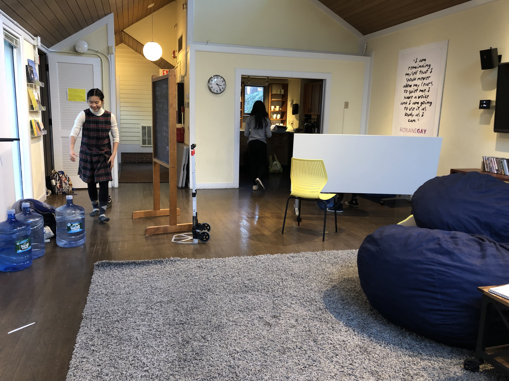
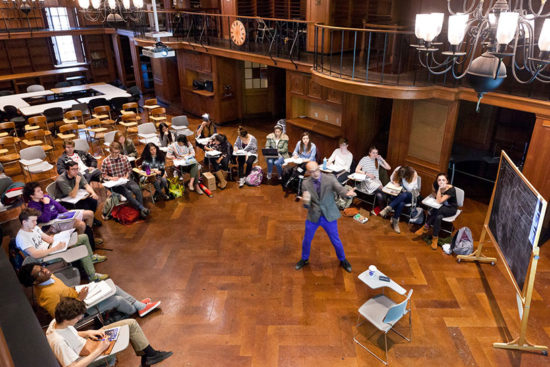
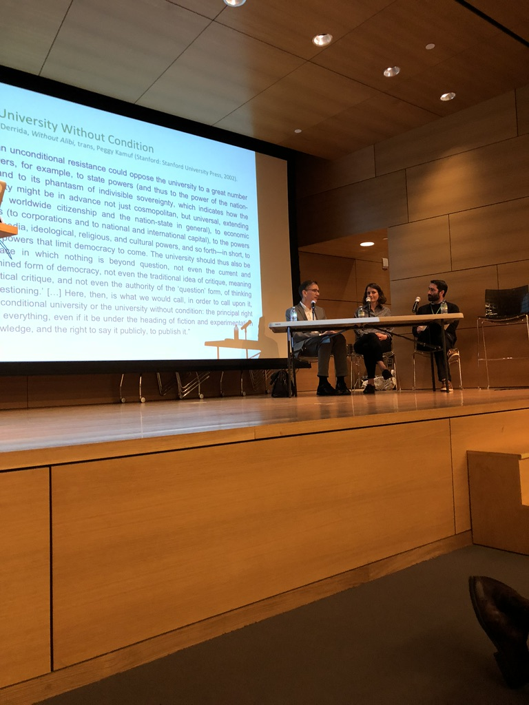

* **_Ewing House_**
	
	1. check availability on their [calendar](https://www.ise.risd.edu/booking)
	2. make a reservation and wait 2-3 business days
	3. if you need immediate confirmation, call 401-277-4908  
	 
* **_Taproom + Carr Haus Conference Room_**
	
1. email [taproom@risd.edu](taproom@risd.edu)
	* the room
	* date/time
	* your phone number
2. if they don't reply soon, visit CSI (2nd floor Carr Haus) and talk to the drop-in advisor directly  
	 
* **_Old Library_**
	
	1. email [reserveclassroom@risd.edu](reserveclassroom@risd.edu)  
	2. if they don't reply, email Holly Pimentel [(hpimente@risd.edu)](hpimente@risd.edu)  
	 
* **_Chace Center Auditorium_**
	
	1. email Pamela Kimel [(pkimel@risd.edu)](pkimel@risd.edu) 
	2. or call her at 401-454-6505