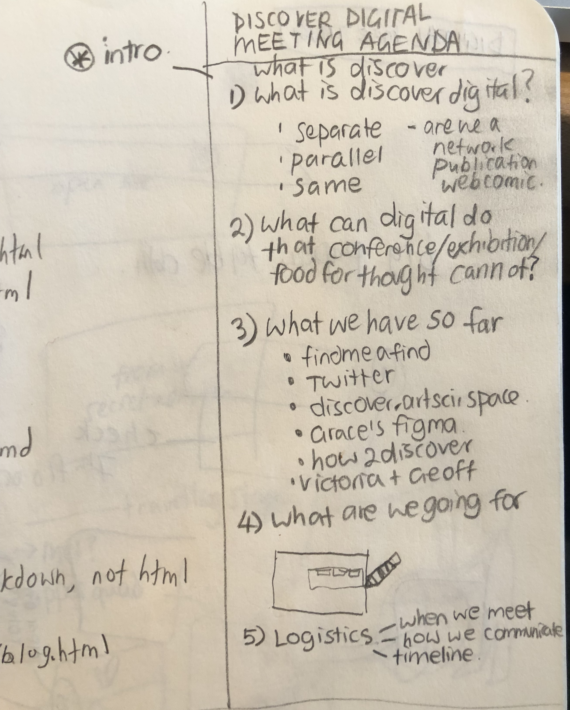

1. create a [when2meet](https://www.when2meet.com/)
2. email/messenger/text everyone you want in the meeting
	* the purpose of meeting
	* the duration
	* the when2meet
3. remind them to fill it in
4. start a messenger group reminder once time is confirmed
5. prepare a meeting agenda
	
6. take minutes on a google doc log (during or after)
	
