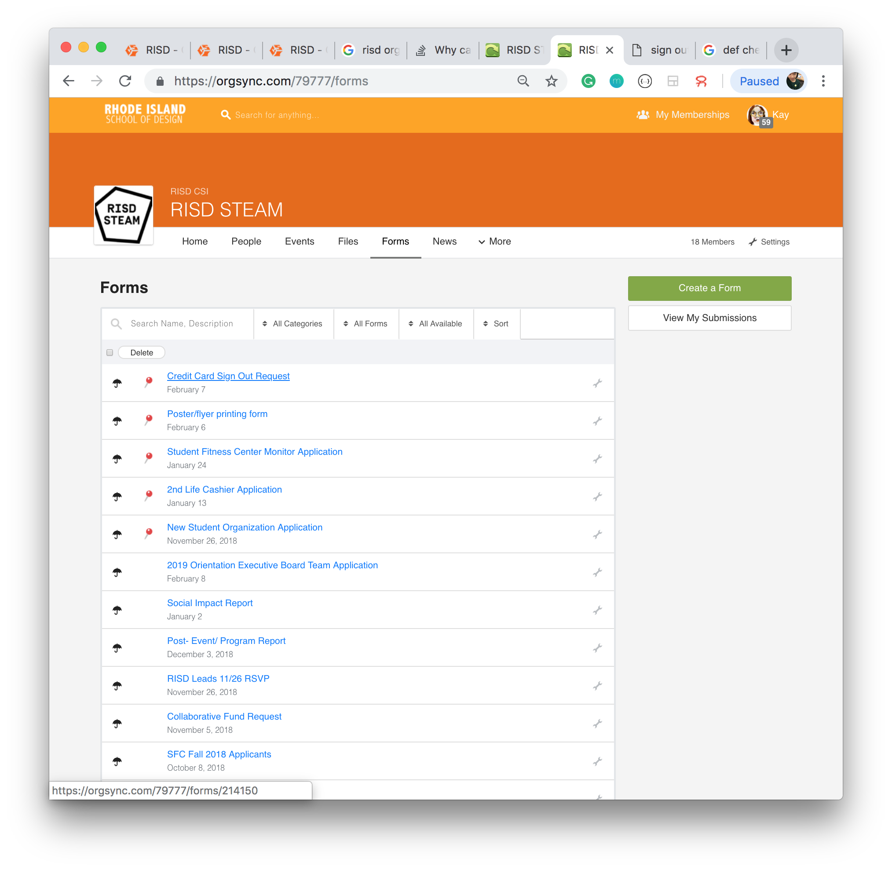

1. sign into [RISD OrgSync](https://orgsync.com/login/rhode-island-school-of-design)
2. go onto [RISD STEAM page](https://orgsync.com/79777/chapter) 
3. Create an event and wait for approval

4. Retrieve event ID

5. Fill in budget request

6. Fill in credit card sign-out [form](https://orgsync.com/79777/forms/214150)

7. Go to CSI Office (_2nd floor Carr Haus 9am-1pm M-F_) to pick up credit card from walk-in advisor. They may approve your credit card request then