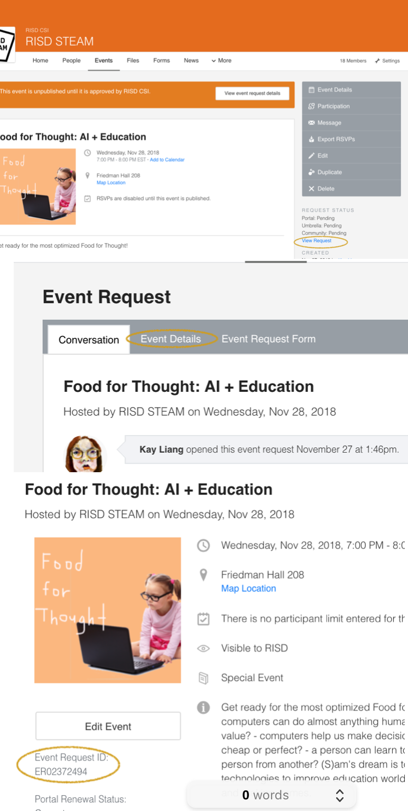

* **_normal method_**
1. sign into [RISD OrgSync](https://orgsync.com/login/rhode-island-school-of-design)
2. go onto [RISD STEAM page](https://orgsync.com/79777/chapter) 
3. create an [event](https://orgsync.com/79777/events/new)

4. retrieve event id (needed for the print request)

5. fill in a [printing form](https://orgsync.com/79777/forms/153849)

6. find CSI walk-in advisor (2nd floor Carr Haus) before 1pm and borrow the printing card. They may have to approve your printing form then.  
 

* **_fast (but slow reimbursement) method_**
1. print with your RISD card
2. print out your RISD bucks payment log and fill in a reimbursement form at CSI
3. go to your club [budget](https://orgsync.com/79777/budget/744140)

4. wait about a month for your check to arrive in the mail