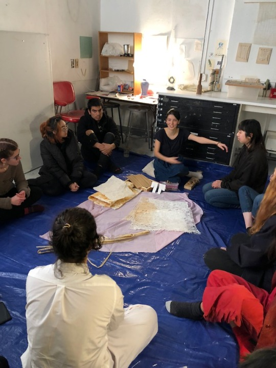

1. confirm your speaker's availability
2. meet with  your speaker the week before to design the event together  
3. understand your  speaker's intentions and content

4. present them with examples and possible structures for the event
	* e.g. 10 min buffer, 15 min presentation, 30 min discussion, 5 min buffer
	* e.g. performance, lecture, workshop, participatory art, timed discussion
5. brainstorm possible spaces and food
	* e.g. Friedman, Nature Lab, Printmaking, Page-Robinson, Ewing House, Carr Haus
6. finalize event logistics, including payment for food and props
7. publicize event 1 or 2 days before
	* on facebook
	* by [email](send-email) 
	* personally to beloved friends
8. gather snacks and/or cook together (esp with your speaker) the night before

9. remind everyone on the day
	* post progress photos (cooking together) on the facebook event
	* [email](send-email) everyone on the morning
	* bump into your friends or text them
10. set-up and do a run-through 30 minutes before the event
11. patiently wait for your audience who usually arrive a few minutes late

