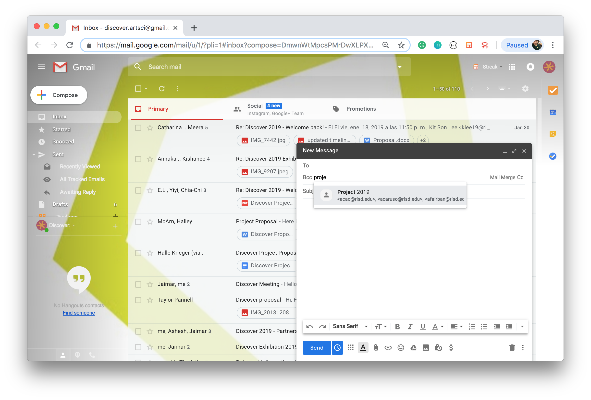

1. sign in
	* username: [discover.artsci@gmail.com](discover.artsci@gmail.com)
	* password: discoverduality
2. compose new email and bcc the "Project 2019" contact group

3. add new emails on [contacts.google.com](https://contacts.google.com/)
	* make sure you're on the Discover account
	* create contact in the "Project 2019" label

